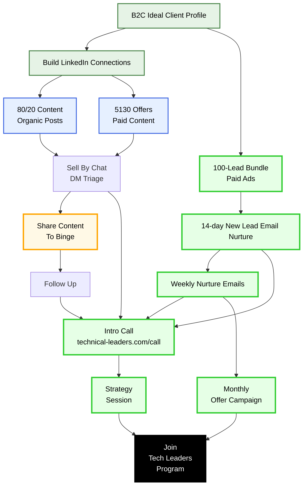

# Technical Leaders Funnel Architecture

## Funnel Overview

This diagram represents the Technical Leaders customer acquisition funnel with the following stages:

1. **Entry Points**: B2C Ideal Customer Profile leads to building LinkedIn connections
2. **Content Distribution**: Three channels:
   - **Organic Posts**: 80/20 content strategy
   - **Paid Content**: 5130 offers
   - **Paid Ads**: 100-lead bundle (flows directly to email nurture)
3. **Triage**: Sell By Chat DM triage for organic and paid content leads
4. **Primary Actions**: Two main paths from triage:
   - **Share Content To Binge**: Leading to follow-up
   - **Intro Call**: Direct scheduling
5. **Nurture Sequences**:
   - **14-day New Lead Email Nurture**: For paid ad leads
   - **Weekly Nurture Emails**: Ongoing engagement
6. **Sales Engagement**:
   - **Monthly Offer Campaign**: From email nurture
   - **Strategy Session**: From intro calls
7. **Final Conversion**: Tech Leaders Program enrollment

The color coding helps distinguish between different funnel stages:
- Green: Entry points
- Blue: Content distribution
- Yellow: Primary actions
- Purple: Nurture sequences
- Light green: Sales engagement
- Red: Final conversion