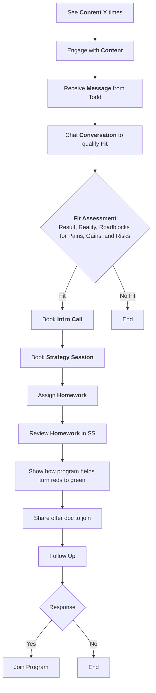

# Customer Journey

```mermaid
flowchart TD
    A[See <b>Content</b> X times] --> B[Engage with <b>Content</b>]
    B --> C[Receive <b>Message</b> from Todd]
    C --> D[Chat <b>Conversation</b> to qualify <b>Fit</b>]
    D --> E{<b>Fit Assessment</b><br/>Result, Reality, Roadblocks for Pains, Gains, and Risks}
    E -->|Fit| F[Book <b>Intro Call</b>]
    E -->|No Fit| G[End]
    F --> H[Book <b>Strategy Session</b>]
    H --> I[Assign <b>Homework</b>]
    I --> J[Review <b>Homework</b> in SS]
    J --> K[Show how program helps turn reds to green]
    K --> L[Share offer doc to join]
    L --> M[Follow Up]
    M --> N{Response}
    N -->|Yes| O[Join Program]
    N -->|No| P[End]
```