# Customer Journey

## Sales Journey (Lead Gen & Conversion)

---

## Website Analytics - Customer Journey Analysis

**Analysis Date:** October 1, 2025
**Data Period:** Last 30 days
**Source:** PostHog Analytics (Tech Leaders Website Project)

### Traffic Sources

- **Direct Traffic**: 296 visitors (85%)
- **Google OAuth**: 31 visitors (9%)
- **Clerk Auth Redirect**: 25 visitors (7%)
- **kovana.ai Referral**: 8 visitors (2.3%)
- **Google Search**: 2 visitors (0.6%)

### Top Pages by Views

1. `/upload-policy` - 864 views ⭐ (Main product page)
2. `/` (homepage) - 248 views
3. `/sign-in` - 178 views
4. `/settings` - 127 views
5. `/free-trial` - 121 views
6. `/sign-up` - 104 views
7. `/choose-account-type` - 79 views
8. `/verify-credit-card` - 47 views

### Conversion Funnel Performance

| Step | Users | Conversion Rate | Drop-off |
|------|-------|----------------|----------|
| Landing Page (/) | 52 | 100% | - |
| Free Trial Page | 7 | 13.5% | 86.5% |
| Sign Up | 1 | 1.9% | 85.7% from previous |
| Choose Account Type | 0 | 0% | 100% |
| Upload Policy | 0 | 0% | - |

**Total Funnel Conversion**: 0% (0 users complete the full journey)

### Website Journey Visualization

### Conversion Funnel Detail

```mermaid
%%{init: {'theme':'base', 'themeVariables': { 'primaryColor':'#4F46E5'}}}%%
graph LR
    subgraph Conversion["Conversion Funnel Analysis"]
        direction TB
        S1["Landing Page<br/>52 users<br/>█████████████████████<br/>100%"]
        S2["Free Trial<br/>7 users<br/>███<br/>13.5%<br/>⚠️ 86.5% drop"]
        S3["Sign Up<br/>1 user<br/>▌<br/>1.9%<br/>❌ 98.1% total drop"]
        S4["Account Type<br/>0 users<br/><br/>0%<br/>🚫 Complete blockage"]
        S5["Upload Policy<br/>0 users<br/><br/>0%<br/>🚫 No funnel success"]

        S1 --> S2
        S2 --> S3
        S3 --> S4
        S4 --> S5
    end

    subgraph Reality["Actual User Behavior"]
        direction TB
        Direct["Direct Access<br/>864 views"]
        Bypass["⚡ Users bypass<br/>entire funnel"]
        Product["Upload Policy<br/>Main Product"]

        Direct --> Bypass
        Bypass --> Product
    end

    Conversion -.->|"Users avoid<br/>broken funnel"| Reality

    classDef critical fill:#EF4444,stroke:#DC2626,stroke-width:3px,color:#fff
    classDef success fill:#10B981,stroke:#059669,stroke-width:2px,color:#fff

    class S3,S4,S5 critical
    class Product success
```

### 🔴 Critical Issues

#### 1. Broken Signup Funnel
- **98% drop-off** from landing page to sign-up completion
- Only 1 out of 52 users who land on the homepage complete signup
- Zero users reach the "Choose Account Type" step

#### 2. Disconnected Product Experience
- Upload Policy has 864 views but isn't reached through the signup funnel
- Users are bypassing the entire onboarding flow
- Suggests existing users have found workarounds

#### 3. Account Type Bottleneck
- Complete blockage at "Choose Account Type" step
- Zero users progressing past signup to this step
- May indicate a technical issue or UX problem

### 🟢 Positive Patterns

#### 1. Strong Direct Traffic
- 85% direct traffic indicates good brand recognition
- Users know where to go and return frequently

#### 2. Active User Base
- High upload-policy views (864) show product engagement
- Existing users are actively using the core feature
- Indicates product-market fit for current users

#### 3. Functional Auth Integration
- Google OAuth (31 visitors) working properly
- Clerk authentication redirects functioning (25 visitors)
- Auth infrastructure is solid

### 💡 Recommendations

#### Immediate Actions (P0)

1. **Fix Signup Flow**
   - Investigate the drop between Free Trial → Sign Up (85.7% loss)
   - Add analytics to identify where users abandon
   - Test simplified signup form

2. **Resolve Account Type Blocker**
   - Debug why zero users reach "Choose Account Type"
   - Check for JavaScript errors or broken navigation
   - Consider removing this step entirely if not essential

3. **Connect Funnel to Product**
   - Ensure newly signed-up users are directed to Upload Policy
   - Create onboarding flow that ends at the main product feature
   - Test the complete journey end-to-end

#### Short-term Improvements (P1)

4. **Reduce Authentication Friction**
   - Email verification + credit card verification may be too much
   - Consider delayed credit card verification
   - Test social login as primary signup method

5. **A/B Test Landing Page**
   - Test "Start Uploading" CTA vs "Free Trial" CTA
   - Experiment with direct product access for trial users
   - Measure impact on signup completion

6. **Improve Free Trial Conversion**
   - Analyze why 86.5% drop at this step
   - Add trust signals, testimonials, or demo
   - Clarify value proposition on free trial page

#### Long-term Strategy (P2)

7. **User Research**
   - Interview users who completed signup successfully
   - Interview users who abandoned at Free Trial page
   - Understand how existing users found workarounds

8. **Funnel Analytics Enhancement**
   - Add event tracking for button clicks
   - Track form field interactions
   - Monitor error messages and validation failures

9. **Alternative Onboarding Paths**
   - Create express signup for low-friction entry
   - Offer "Upload Now" option with lightweight registration
   - Build progressive profile completion

### Key Insights

**The Paradox**: You have clear product-market fit (864 upload-policy views) but a completely broken acquisition funnel (0% completion rate). This suggests:

- **Existing users love the product** and use it regularly (direct traffic)
- **New users can't get in** through the intended signup flow
- **Growth is constrained** by acquisition funnel issues, not product issues

**Priority**: Fix the signup funnel immediately. You're likely losing significant revenue from users who want to use the product but can't complete signup.

### Next Steps

1. Set up funnel monitoring in PostHog to track daily conversion rates
2. Create alerts for when signup completion drops below threshold
3. Schedule user interviews with recent signups and abandonments
4. Run technical audit of signup flow for bugs/errors
5. Design and implement A/B tests for critical drop-off points
