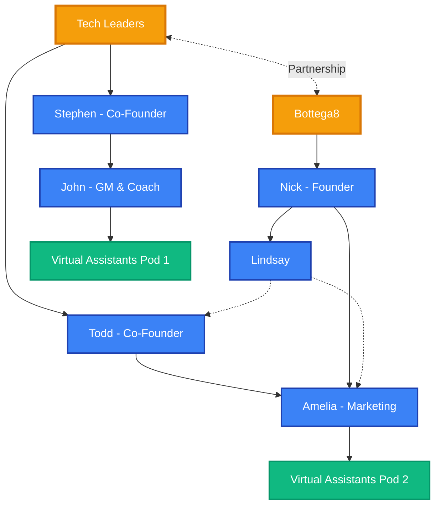

# Organization Chart

## Company Structure

### Tech Leaders
- **Todd** - Co-Founder
- **Stephen** - Co-Founder
- **John** - CTO
- **Amelia** - VP Marketing
- **Virtual Assistants Pod 1** - Support Staff
- **Virtual Assistants Pod 2** - Support Staff

### Bottega8
- **Nick** - Founder
- **Lindsay** - (Reports to Nick with dotted line connections to Todd and Amelia)

### Partnership
- Tech Leaders and Bottega8 maintain a strategic partnership through the founders